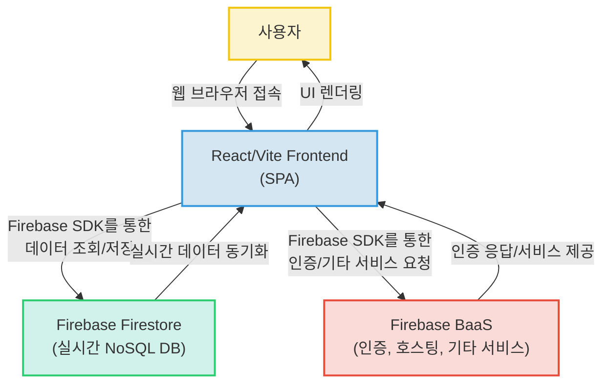

# 라이어 게임 웹 애플리케이션


## 프로젝트 소개

본 프로젝트는 React와 Firebase를 활용하여 구현된 실시간 웹 기반 '라이어 게임' 애플리케이션입니다. 사용자들은 웹 브라우저를 통해 게임에 참여하여 제시어를 추리하고, 라이어를 찾아내거나 자신의 정체를 숨기면서 즐거운 시간을 보낼 수 있습니다. 이 프로젝트는 최신 프론트엔드 기술과 서버리스 아키텍처를 결합하여 빠르고 효율적인 개발 및 운영을 목표로 합니다.

## 주요 기능

제공된 정보가 제한적이므로, 프로젝트의 기술 스택과 핵심 파일 분석을 바탕으로 예상되는 주요 기능은 다음과 같습니다.

*   **실시간 게임 상태 동기화 (추정)**: Firebase Firestore를 통해 플레이어의 입장, 퇴장, 역할 할당, 투표 결과 등 게임의 모든 상태가 실시간으로 동기화되어 모든 참가자가 최신 정보를 공유합니다.
*   **플레이어 역할 및 제시어 표시 (추정)**: 각 플레이어에게 할당된 역할(라이어/시민)과 제시어가 카드 형태로 시각적으로 명확하게 표시됩니다. (`src/assets/CARD*.png` 파일 및 `TeamCards` 컴포넌트 분석 기반)
*   **직관적인 UI/UX (추정)**: React 컴포넌트 기반으로 설계된 UI는 사용자가 게임의 흐름을 쉽게 이해하고 몰입할 수 있도록 돕습니다. (`index.css` 분석 기반)
*   **서버리스 아키텍처**: 별도의 백엔드 서버 구축 없이 Firebase의 BaaS(Backend as a Service)를 활용하여 효율적인 자원 관리와 확장성을 확보합니다.

## 프로젝트 구조

프로젝트의 전체 디렉토리 구조에 대한 정보는 제공되지 않았습니다. 일반적인 React/Vite 프로젝트 구조를 따를 것으로 추정됩니다.

```
├── public/                 # 정적 파일 (index.html 등)
├── src/                    # 소스 코드 디렉토리
│   ├── assets/             # 이미지, 폰트 등 정적 자산 (e.g., CARD*.png)
│   ├── components/         # 재사용 가능한 UI 컴포넌트
│   │   ├── Header.jsx
│   │   ├── Footer.jsx
│   │   └── TeamCards.jsx (추정)
│   ├── hooks/              # 사용자 정의 React Hook (추정)
│   ├── utils/              # 유틸리티 함수 (추정)
│   ├── App.jsx             # 메인 애플리케이션 컴포넌트
│   ├── firebase.js         # Firebase 초기화 및 설정
│   ├── index.css           # 전역 스타일
│   └── main.jsx            # React 애플리케이션 엔트리 포인트
├── .eslintrc.cjs           # ESLint 설정 파일
├── index.html              # 애플리케이션의 기본 HTML
├── package.json            # 프로젝트 메타데이터 및 의존성
├── package-lock.json       # 패키지 의존성 잠금 파일
└── vite.config.js          # Vite 설정 파일
```

## 핵심 파일 설명

*   `package.json`: 프로젝트의 메타데이터, 의존성 관리 및 스크립트 정의 파일입니다. `react`, `firebase`, `vite`와 같은 핵심 기술 스택의 버전을 명시하여 프로젝트의 기술 기반을 명확히 보여줍니다. 개발(dev) 및 빌드(build) 스크립트가 정의되어 있어 프로젝트 실행 방식을 알 수 있습니다.
*   `src/main.jsx`: React 애플리케이션의 시작점입니다. `index.html`에 의해 로드되어 `src/App.jsx` 컴포넌트를 브라우저의 DOM에 렌더링하며, 애플리케이션의 전반적인 구동을 담당합니다.
*   `src/App.jsx`: 애플리케이션의 최상위 루트 컴포넌트입니다. 전반적인 UI 레이아웃을 구성하고, `Header.jsx`, `Footer.jsx`와 같은 공통 컴포넌트 및 게임의 핵심 화면 컴포넌트들을 포함하여 게임의 주요 흐름을 제어할 것으로 추정됩니다.
*   `src/firebase.js`: Firebase SDK를 초기화하고 Firestore 데이터베이스 인스턴스를 설정하는 파일입니다. 환경 변수(`import.meta.env`)를 사용하여 API 키를 관리하는 모범 사례를 따르고 있으며, 게임 데이터를 저장하고 실시간으로 동기화하는 데 필수적인 구성 요소입니다.
*   `src/components/TeamCards.jsx` (추정): '라이어 게임'의 특성을 고려할 때, 이 컴포넌트는 플레이어들에게 할당된 역할 카드나 팀 정보를 시각적으로 표시하는 데 사용될 것으로 추정됩니다. `src/assets` 디렉토리의 `CARD*.png` 파일들과 함께 게임의 핵심적인 사용자 경험을 제공하는 UI 요소일 가능성이 높습니다.
*   `src/index.css`: 애플리케이션의 주요 시각적 스타일을 정의하는 파일입니다. `.app`, `.site-header`, `.panel`, `.grid`, `.card`, `.player-list`, `.tab` 등 다양한 클래스 셀렉터를 통해 전반적인 레이아웃, 컴포넌트 디자인, 반응형 동작 등을 제어하여 사용자에게 일관된 시각적 경험을 제공합니다.
*   `index.html`: 웹 애플리케이션의 기본 HTML 파일입니다. `div` 태그 내에 `id='root'` 요소를 포함하여 React 애플리케이션이 마운트될 지점을 제공하며, `<script type='module' src='/src/main.jsx'></script>`를 통해 React 앱의 시작점을 로드합니다.

## 기술 스택

### Frontend

*   **React (^19.2.4)**: 컴포넌트 기반으로 인터랙티브한 UI를 효율적으로 개발하여 재사용성과 유지보수성을 높일 수 있습니다.
*   **Vite (^8.0.1)**: 매우 빠른 개발 서버와 번들링 속도를 제공하여 개발 생산성을 크게 향상시킬 수 있습니다.
*   **HTML/CSS**: 웹 애플리케이션의 기본 구조와 디자인을 구축하여 사용자에게 시각적으로 매력적인 경험을 제공합니다.

### Backend

*   **Firebase (BaaS, SDK ^12.11.0)**: 서버 구축 및 관리에 대한 부담 없이 빠르고 확장 가능한 백엔드 기능을 구현하여 개발 시간을 단축할 수 있습니다.

### Database

*   **Firebase Firestore**: 실시간 데이터 동기화 기능을 통해 다수의 사용자 간 게임 상태를 즉시 반영하고, NoSQL의 유연성으로 데이터를 효율적으로 관리할 수 있습니다.

### DevOps

*   **ESLint (^9.39.4)**: 코드 스타일 일관성을 유지하고 잠재적인 오류를 사전에 방지하여 코드 품질을 높이고 협업 효율성을 증대시킬 수 있습니다.
*   **npm (패키지 매니저)**: 프로젝트 의존성을 체계적으로 관리하고, 개발, 빌드, 린트 등의 스크립트를 정의하여 개발 워크플로우를 효율화합니다.

## 시스템 아키텍처

이 프로젝트는 React와 Vite로 구축된 단일 페이지 애플리케이션(SPA)으로, 클라이언트 측에서 Firebase SDK를 통해 직접 Firebase Firestore 데이터베이스와 연동하여 실시간 게임 데이터를 처리합니다. 별도의 서버 구축 없이 Firebase의 BaaS(Backend as a Service) 모델을 활용하여 개발 및 운영 효율성을 극대화한 서버리스 아키텍처입니다. 이를 통해 프론트엔드 개발에 집중하고 실시간 인터랙션 기능을 효율적으로 구현할 수 있습니다.

**핵심 포인트:**

*   React와 Vite를 활용한 최신 프론트엔드 개발 환경 구축
*   Firebase BaaS를 통한 서버리스 아키텍처 채택으로 백엔드 개발 및 관리 부담 최소화
*   Firebase Firestore를 이용한 실시간 데이터 동기화 구현으로 '라이어 게임'의 핵심 요구사항 충족
*   클라이언트 측에서 Firebase SDK를 직접 사용하여 데이터베이스와 상호작용



## 실행 방법

추가 작성 필요: 프로젝트 실행 방법에 대한 상세 정보가 제공되지 않았습니다. 일반적인 React/Vite 프로젝트 실행 절차를 따를 것으로 예상됩니다.

1.  **저장소 클론**:
    ```bash
    git clone https://github.com/yeverycode/liar-game.git
    cd liar-game
    ```
2.  **의존성 설치**:
    ```bash
    npm install
    ```
3.  **Firebase 설정**:
    *   Firebase 프로젝트를 생성하고, 웹 앱을 등록합니다.
    *   `src/firebase.js` 파일 또는 환경 변수(`.env` 파일)에 Firebase 설정(`apiKey`, `authDomain`, `projectId` 등)을 추가합니다. (예: `.env` 파일에 `VITE_FIREBASE_API_KEY=your_api_key`와 같이 설정)
4.  **개발 서버 실행**:
    ```bash
    npm run dev
    ```
    브라우저에서 `http://localhost:5173` (또는 지정된 포트)으로 접속하여 애플리케이션을 확인할 수 있습니다.
5.  **프로덕션 빌드 (선택 사항)**:
    ```bash
    npm run build
    ```
    `dist` 디렉토리에 빌드된 정적 파일들이 생성됩니다.

## 기술 선택 이유

*   **React**: 컴포넌트 기반의 UI 개발을 통해 재사용성과 유지보수성을 극대화하고, 인터랙티브한 사용자 경험을 효율적으로 구축하기 위해 선택했습니다.
*   **Vite**: 매우 빠른 개발 서버 구동과 번들링 속도를 제공하여 개발 생산성을 크게 향상시키며, 최신 JavaScript 기능을 효율적으로 활용할 수 있게 해줍니다.
*   **Firebase BaaS**: 서버 구축 및 관리에 대한 부담을 줄이고, 개발 시간을 단축하여 핵심 게임 로직 구현에 집중할 수 있도록 서버리스 환경을 제공하기 위해 채택했습니다.
*   **Firebase Firestore**: 실시간 데이터 동기화 기능을 통해 다수의 플레이어 간 게임 상태를 즉시 반영하고, NoSQL의 유연성으로 게임 데이터를 효율적으로 관리할 수 있어 '라이어 게임'과 같은 실시간 인터랙션이 중요한 애플리케이션에 적합합니다.
*   **ESLint**: 코드 품질을 일관성 있게 유지하고 잠재적인 오류를 사전에 방지하여, 협업 시 코드 리뷰 비용을 줄이고 안정적인 코드 베이스를 구축하기 위해 활용했습니다.

## 개선 방향

현재 프로젝트 분석 결과와 불확실한 부분을 바탕으로 다음과 같은 개선 방향을 제안합니다.

*   **사용자 인증 방식 명확화**: 현재 `firebaseConfig`에는 `authDomain` 필드가 있지만, 명시적인 사용자 인증 로직이 보이지 않습니다. 익명 로그인, Google/이메일 등 구체적인 인증 방식을 구현하여 사용자 식별 및 게임 참여 권한을 관리하는 것이 필요합니다.
*   **구체적인 게임 규칙 및 단계 구현**: '라이어 게임'의 핵심인 라운드 관리, 제시어 부여, 투표, 라이어 지목, 결과 판정 등 구체적인 게임 로직과 상태 전이를 `App.jsx` 또는 별도의 게임 로직 모듈 내에 체계적으로 구현해야 합니다.
*   **전체 컴포넌트 목록 및 라우팅 구축**: 게임 로비, 게임 진행 화면, 결과 화면 등 다양한 게임 단계를 위한 전용 컴포넌트들을 `src/components` 내에 구조화하고, `react-router-dom`과 같은 라이브러리를 사용하여 페이지 간 원활한 라우팅을 구현할 필요가 있습니다.
*   **에러 처리 및 로딩 상태 관리**: 데이터 로딩 중 발생할 수 있는 네트워크 오류, Firebase 연동 실패 등의 예외 상황에 대한 사용자 친화적인 에러 처리 로직을 구현하고, 데이터를 기다리는 동안 로딩 스피너나 메시지를 표시하여 사용자 경험을 개선해야 합니다.
*   **상태 관리 라이브러리 도입 (추정)**: 게임의 복잡도가 높아짐에 따라 전역 상태 관리를 위한 Redux, Recoil, Zustand 등 전문 상태 관리 라이브러리를 도입하여 상태 로직을 더욱 체계적으로 관리하고 예측 가능하게 만들 수 있습니다.
*   **테스트 코드 작성**: 컴포넌트 및 핵심 게임 로직에 대한 단위 테스트, 통합 테스트를 작성하여 코드의 안정성을 확보하고 향후 유지보수 및 기능 확장을 용이하게 할 수 있습니다.