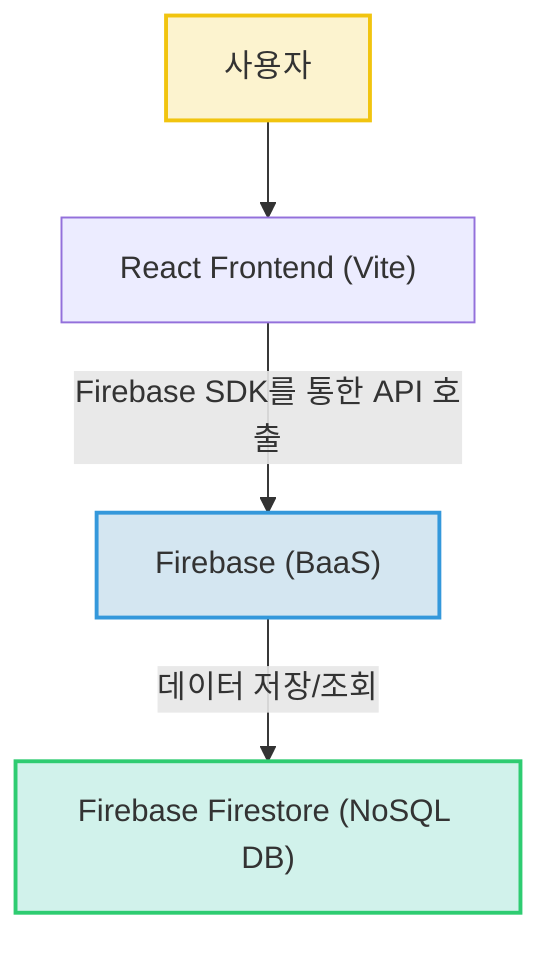

# 라이어 게임 (Liar Game)


## 🚀 프로젝트 소개

이 프로젝트는 인기 있는 마피아 게임의 일종인 '라이어 게임'을 웹 기반으로 구현한 애플리케이션입니다. React와 Vite를 프론트엔드 개발에 활용하고, Firebase를 백엔드 서비스(BaaS)로 사용하여 빠르고 효율적인 개발이 가능하도록 설계되었습니다. 실시간 데이터 동기화가 가능한 Firebase Firestore를 통해 게임 진행 상황을 관리하며, 사용자들이 웹에서 손쉽게 라이어 게임을 즐길 수 있도록 하는 것을 목표로 합니다.

본 README는 프로젝트 분석 결과를 바탕으로 작성되었으며, 면접 및 포트폴리오 제출 시 프로젝트의 기술적 이해도와 분석 능력을 보여주기 위해 구성되었습니다.

## ✨ 주요 기능

이 프로젝트는 '라이어 게임'의 핵심적인 요소를 구현할 것으로 추정됩니다.

*   **게임 역할 카드 표시 (추정)**: 플레이어들에게 할당된 역할(예: 시민, 라이어)과 제시어를 보여주는 카드 UI를 제공합니다. (`src/components/TeamCards.jsx` 및 `src/assets/CARD*.png` 기반 추정)
*   **실시간 게임 상태 동기화 (추정)**: Firebase Firestore를 통해 여러 플레이어 간의 게임 상태(예: 게임 시작/종료, 역할 할당, 투표 결과)를 실시간으로 동기화합니다.
*   **직관적인 사용자 인터페이스 (추정)**: React 기반의 컴포넌트 구조를 활용하여 사용자가 게임에 쉽게 참여하고 진행할 수 있는 UI를 제공합니다.

## 📁 프로젝트 구조

프로젝트의 핵심 디렉토리 및 파일 구조는 다음과 같을 것으로 추정됩니다.

```
.
├── public/                # 정적 파일 (index.html 등)
├── src/
│   ├── assets/            # 이미지, 아이콘 등 정적 리소스
│   │   └── CARD*.png      # 게임 내 사용될 카드 이미지 파일
│   ├── components/        # 재사용 가능한 UI 컴포넌트 모음
│   │   └── TeamCards.jsx  # 팀 카드 또는 역할 카드를 표시하는 컴포넌트 (추정)
│   ├── App.jsx            # 애플리케이션의 루트 컴포넌트
│   ├── firebase.js        # Firebase 초기화 및 설정 파일
│   └── main.jsx           # React 애플리케이션 엔트리 포인트
├── .eslintrc.cjs          # ESLint 설정 파일
├── index.html             # 웹 애플리케이션의 기본 HTML 파일
├── package.json           # 프로젝트 의존성 및 스크립트 정의
├── vite.config.js         # Vite 설정 파일
└── README.md
```

## 📝 핵심 파일 설명

*   **`package.json`**:
    프로젝트의 이름('liar-game'), 버전, 개발 및 빌드 스크립트를 정의합니다. 특히 `firebase`, `react`, `react-dom`, `vite`와 같은 핵심 기술 스택의 의존성을 명시하여, 프로젝트의 기술 기반을 이해하는 데 중요한 정보를 제공합니다.
*   **`src/main.jsx`**:
    React 애플리케이션의 시작점입니다. 이 파일은 `index.html`에 의해 로드되어 `src/App.jsx` 컴포넌트를 브라우저에 렌더링하며, 애플리케이션의 전반적인 구동을 담당합니다.
*   **`src/App.jsx`**:
    애플리케이션의 최상위 루트 컴포넌트입니다. 전반적인 UI 레이아웃을 구성하고, 다른 주요 컴포넌트들을 포함하여 게임의 핵심 흐름이나 화면을 제어할 것으로 추정됩니다.
*   **`src/firebase.js`**:
    Firebase SDK를 초기화하고 Firestore 데이터베이스 인스턴스를 설정하는 파일입니다. 게임 데이터를 저장하고 실시간으로 동기화하는 데 필수적인 구성 요소이며, 프로젝트가 Firebase를 어떻게 활용하는지 보여줍니다.
*   **`src/components/TeamCards.jsx`**:
    '라이어 게임'의 특성을 고려할 때, 이 컴포넌트는 플레이어들에게 할당된 역할 카드나 팀 정보를 시각적으로 표시하는 데 사용될 것으로 추정됩니다. 게임의 핵심적인 사용자 경험을 제공하는 UI 요소일 가능성이 높습니다.
*   **`src/assets/CARD*.png`**:
    게임 내에서 사용될 다양한 카드 이미지 파일들입니다. `TeamCards.jsx`와 함께 게임의 시각적 테마와 핵심적인 플레이 요소를 구성하는 데 기여합니다.

## 🛠️ 기술 스택

이 프로젝트는 다음과 같은 기술 스택을 활용하여 개발되었습니다.

*   **Frontend**:
    *   **React (`^19.2.4`)**: 현대적이고 상호작용적인 UI를 컴포넌트 기반으로 효율적으로 개발할 수 있습니다.
    *   **Vite (`^8.0.1`)**: 빠르고 효율적인 개발 서버와 번들링을 제공하여 개발 생산성을 높일 수 있습니다.
    *   **HTML/CSS**: 웹 애플리케이션의 기본 구조와 스타일링을 담당하여 사용자 인터페이스를 구축할 수 있습니다.
*   **Backend**:
    *   **Firebase (SDK `^12.11.0`)**: 서버리스 백엔드 서비스(BaaS)를 활용하여 빠른 개발과 확장성을 확보할 수 있습니다.
*   **Database**:
    *   **Firebase Firestore**: 실시간 데이터 동기화가 가능한 NoSQL 데이터베이스로, 복잡한 백엔드 서버 구축 없이 데이터를 저장하고 관리할 수 있습니다.
*   **DevOps / Linter**:
    *   **ESLint (`^9.39.4`)**: 코드 일관성을 유지하고 잠재적인 오류를 미리 발견하여 코드 품질을 향상시킬 수 있습니다.
    *   **npm (또는 유사 패키지 매니저)**: 프로젝트 의존성을 효율적으로 관리하고 빌드 및 개발 스크립트를 실행할 수 있습니다.

## 🏗️ 시스템 아키텍처

이 프로젝트는 React와 Vite를 기반으로 구축된 단일 페이지 애플리케이션(SPA)입니다. 사용자 인터페이스는 React 컴포넌트들로 구성되며, Vite를 통해 개발 및 빌드됩니다. 백엔드 로직 및 데이터 관리는 Google Firebase의 Backend as a Service(BaaS) 모델을 활용하여, Firebase SDK를 통해 Firestore 데이터베이스에 직접 데이터를 저장하고 조회합니다. 이를 통해 백엔드 서버 구축 및 관리 부담을 줄이고 프론트엔드 개발에 집중하여 빠르고 효율적으로 웹 애플리케이션을 개발할 수 있는 아키텍처입니다.

### 핵심 포인트

*   **React + Vite 기반 Frontend**: React 19와 Vite를 사용하여 현대적인 웹 애플리케이션을 빠르게 개발하고 배포할 수 있는 구조입니다.
*   **Firebase BaaS 활용**: 백엔드 서버를 직접 구축하지 않고 Firebase를 BaaS(Backend as a Service)로 사용하여 개발 시간과 관리 오버헤드를 크게 줄였습니다.
*   **Firestore 실시간 데이터베이스**: Firebase Firestore를 데이터베이스로 채택하여 실시간 데이터 동기화 기능을 활용하고, NoSQL의 유연성으로 데이터를 관리합니다.
*   **서버리스 아키텍처 지향**: 프론트엔드와 BaaS의 조합으로 서버리스에 가까운 아키텍처를 구성하여 확장성과 유지보수 용이성을 확보했습니다.

### 아키텍처 다이어그램



## 🏃‍♀️ 실행 방법

### **추가 작성 필요**

프로젝트 실행을 위한 구체적인 방법은 제공되지 않았습니다. 일반적으로 React/Vite 프로젝트와 Firebase가 연동된 경우 다음과 같은 단계를 따릅니다.

1.  **저장소 클론**:
    ```bash
    git clone https://github.com/yeverycode/liar-game.git
    cd liar-game
    ```
2.  **의존성 설치**:
    ```bash
    npm install
    # 또는 yarn install
    ```
3.  **Firebase 설정**:
    *   Firebase 프로젝트를 생성하고, 웹 앱을 등록합니다.
    *   `src/firebase.js` 파일에 Firebase 콘솔에서 제공하는 구성 정보를 업데이트합니다. (API Key, Project ID 등)
4.  **개발 서버 실행**:
    ```bash
    npm run dev
    # 또는 yarn dev
    ```
    브라우저에서 `http://localhost:5173` (또는 지정된 포트)로 접속하여 애플리케이션을 확인할 수 있습니다.
5.  **배포용 빌드**:
    ```bash
    npm run build
    # 또는 yarn build
    ```
    `dist` 디렉토리에 빌드된 정적 파일이 생성됩니다. 이 파일들을 정적 호스팅 서비스(Firebase Hosting, Netlify 등)에 배포할 수 있습니다.

## 💡 기술 선택 이유

*   **React**: 컴포넌트 기반의 UI 개발을 통해 코드 재사용성을 높이고, 가상 DOM을 활용하여 효율적인 UI 업데이트가 가능하기 때문에 동적이고 복잡한 웹 애플리케이션 구현에 적합합니다.
*   **Vite**: 빠른 개발 서버 구동 속도와 HMR(Hot Module Replacement)을 제공하여 개발 생산성을 크게 향상시키며, Rollup 기반의 최적화된 빌드를 지원하여 배포 시 성능 이점을 가집니다.
*   **Firebase**: 백엔드 서버를 직접 구축하고 관리하는 부담 없이 인증, 데이터베이스, 스토리지 등 필요한 기능을 빠르고 안정적으로 사용할 수 있는 BaaS(Backend as a Service) 솔루션으로, 개발 시간 단축과 확장성 확보에 유리합니다.
*   **Firebase Firestore**: 실시간 데이터 동기화 기능을 제공하여 멀티플레이어 게임과 같은 동적인 웹 애플리케이션에 적합하며, NoSQL 기반의 유연한 데이터 모델링으로 빠른 개발이 가능합니다.
*   **ESLint**: 코드 컨벤션을 통일하고 잠재적인 오류를 미리 찾아내어 코드 품질을 일관되게 유지함으로써 협업 효율성을 높이고 유지보수를 용이하게 합니다.

## 📈 개선 방향

현재 분석된 정보와 불확실한 부분을 기반으로 다음과 같은 개선 방향을 고려할 수 있습니다.

*   **구체적인 게임 규칙 및 로직 구현**:
    라이어 선정 방식, 제시어 할당, 특정 상황에서의 승패 판정 등 '라이어 게임'의 세부적인 규칙을 명확히 정의하고, 이에 따라 게임 로직을 견고하게 구현하여 완성도 높은 게임 플레이 경험을 제공합니다.
*   **멀티플레이어 기능 강화**:
    게임 방 생성 및 참여, 플레이어 입장/퇴장 처리, 게임 시작 및 종료 조건 등 멀티플레이어 환경을 위한 사용자 경험(UX)을 상세하게 설계하고 구현하여 안정적인 게임 플레이를 지원합니다.
*   **사용자 인증 및 권한 관리**:
    Firebase Authentication을 활용하여 사용자 로그인/회원가입 기능을 추가하고, 게임 방 생성 및 참여에 대한 권한 관리를 구현하여 보안성과 사용자 관리 기능을 강화합니다. 익명 참여 옵션도 고려할 수 있습니다.
*   **클라이언트-서버 간 통신 최적화**:
    대규모 동시 접속 환경을 고려하여 Firestore 데이터 모델링을 최적화하고, 데이터 변경 감지(snapshot listener)의 효율적인 사용 및 필요한 경우 Firebase Functions를 활용한 서버리스 로직 추가를 통해 네트워크 부하를 관리하고 성능을 개선합니다.
*   **UI/UX 개선**:
    게임 진행 상황을 직관적으로 보여주는 대시보드, 투표 시스템, 타이머 등 다양한 UI 요소를 추가하고 애니메이션을 적용하여 사용자 경험을 더욱 풍부하게 만듭니다.
*   **에러 핸들링 및 예외 처리**:
    네트워크 문제, Firebase 연동 오류 등 발생할 수 있는 다양한 예외 상황에 대한 에러 핸들링 로직을 추가하여 애플리케이션의 안정성을 높입니다.
*   **테스트 코드 작성**:
    컴포넌트 단위 테스트 및 통합 테스트를 작성하여 코드의 신뢰성을 확보하고, 향후 기능 변경 및 확장에 대한 안정적인 기반을 마련합니다.