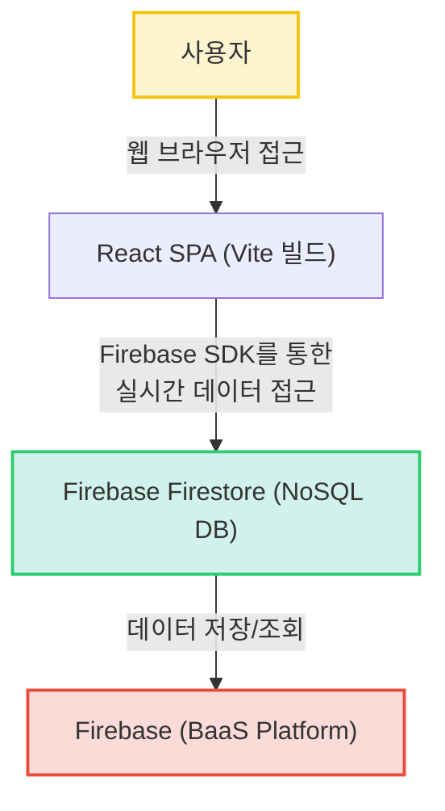

# 라이어 게임 (Liar Game)

## 프로젝트 소개

이 프로젝트는 인기 있는 마피아 게임의 일종인 '라이어 게임'을 웹 환경에서 즐길 수 있도록 구현한 애플리케이션입니다. React와 Vite를 기반으로 구축된 최신 프론트엔드 환경에서 Firebase Firestore를 활용하여 실시간 멀티플레이 기능을 제공합니다. 사용자들은 웹 브라우저를 통해 친구들과 함께 라이어 게임을 즐길 수 있습니다.

## 주요 기능

(아래 기능들은 현재 코드 분석을 바탕으로 추정된 내용입니다.)

*   **실시간 멀티플레이어 게임 진행 (추정)**: Firebase Firestore를 활용하여 여러 사용자가 동시에 게임에 참여하고 실시간으로 상호작용할 수 있는 환경을 제공합니다.
*   **게임 호스트/참여자 기능 (추정)**: 사용자가 새로운 게임방을 생성하거나 기존 게임에 참여하는 기능을 포함할 것으로 예상됩니다. 호스트는 게임의 시작, 라운드 진행 등을 제어할 수 있습니다.
*   **역할 분배 및 단어 제시 (추정)**: 라이어 게임 규칙에 따라 플레이어들에게 일반인 또는 라이어 역할을 부여하고, 각 역할에 맞는 단어를 제시하는 기능을 가질 것으로 보입니다.
*   **투표 및 결과 확인 (추정)**: 라이어를 색출하기 위한 플레이어 간 투표 기능과 투표 결과를 실시간으로 확인하는 기능이 포함될 것으로 예상됩니다.
*   **직관적인 사용자 인터페이스 (추정)**: React 컴포넌트 기반으로 카드, 플레이어 목록, 패널 등 게임 진행에 필요한 UI 요소를 시각적으로 제공하여 사용자 경험을 향상시킵니다.

## 프로젝트 구조

프로젝트의 상세한 디렉토리 구조 정보는 제공되지 않았습니다. 일반적인 React 프로젝트 구조를 따를 것으로 추정되며, `src` 디렉토리 내에 컴포넌트(`components`), 유틸리티(`utils`), 서비스(`services`) 등의 하위 디렉토리가 구성되어 있을 수 있습니다.

## 핵심 파일 설명

*   **`package.json`**: 프로젝트의 메타데이터, 스크립트(예: `dev`, `build`), 의존성 목록(React, Firebase)을 정의합니다. 프로젝트의 기술 스택과 실행 방법을 파악하는 데 핵심적인 파일입니다.
*   **`src/main.jsx`**: React 애플리케이션의 메인 진입점입니다. `index.html`의 `#root` 엘리먼트에 `App` 컴포넌트를 렌더링하며, 전역 CSS(`src/index.css`)를 불러와 적용합니다.
*   **`src/App.jsx`**: 애플리케이션의 최상위 컴포넌트입니다. 전반적인 레이아웃과 게임의 주요 흐름을 담당하며, 다른 컴포넌트들을 조합하여 전체 사용자 경험을 구성할 것으로 추정됩니다.
*   **`src/App.css`**: 애플리케이션 전반의 레이아웃, 컴포넌트 스타일, 반응형 디자인 등을 정의하는 CSS 파일입니다. 게임의 호스트 탭, 패널, 카드, 플레이어 목록 등 구체적인 UI 요소들의 디자인을 포함하여, 프로젝트의 시각적 아이덴티티를 구축하는 데 중요합니다.
*   **`src/firebase.js`**: Firebase 프로젝트를 초기화하고 Firestore 데이터베이스 인스턴스를 익스포트합니다. 이를 통해 애플리케이션은 Firebase의 클라우드 데이터베이스에 접근하여 데이터를 읽고 쓰는 기능을 수행할 수 있습니다.
*   **`vite.config.js`**: Vite 빌드 도구의 설정 파일입니다. React 플러그인을 활성화하여 React 프로젝트를 올바르게 빌드하고 개발 서버를 운영할 수 있도록 합니다.

## 기술 스택

*   **Frontend**:
    *   **React (^19.2.4)**: 재사용 가능한 UI 컴포넌트를 활용하여 인터랙티브한 웹 애플리케이션을 효율적으로 구축할 수 있습니다.
    *   **Vite (^8.0.1)**: 매우 빠른 개발 서버와 번들링 기능을 제공하여 개발 생산성을 크게 향상시킬 수 있습니다.
    *   **JavaScript/JSX**: 웹 표준 언어로 브라우저에서 동적인 사용자 경험을 구현하고 선언적인 UI 작성을 가능하게 합니다.
    *   **CSS (App.css, index.css)**: 시각적으로 매력적이고 사용자 친화적인 웹 페이지 스타일링을 직접 구현하고 관리할 수 있습니다.
*   **Backend**:
    *   **Firebase (^12.11.0)**: 서버리스 백엔드 서비스로 데이터베이스, 인증 등 복잡한 서버 인프라 구축 없이 빠르게 기능을 구현할 수 있습니다.
    *   **Firebase Firestore**: Firebase의 실시간 NoSQL 클라우드 데이터베이스로, 클라이언트 간의 데이터 동기화를 쉽게 구현하고 관리할 수 있습니다.
*   **DevOps**:
    *   **ESLint (^9.39.4)**: 코드 품질을 일관성 있게 유지하고 잠재적인 오류를 미리 방지하여 안정적인 코드베이스를 구축하는 데 기여합니다.
    *   **Git**: 버전 관리 시스템으로 코드 변경 이력을 효율적으로 관리하고 팀원과의 협업을 용이하게 합니다.

## 시스템 아키텍처

이 프로젝트는 React와 Vite를 기반으로 하는 단일 페이지 애플리케이션(SPA)으로, 클라이언트 측에서 Firebase SDK를 통해 직접 Firebase Firestore 데이터베이스와 통신하여 데이터를 처리합니다. 별도의 자체 백엔드 서버 없이 Firebase의 서버리스 기능을 활용하여 빠르게 프로토타입을 개발하고 배포할 수 있는 구조입니다. 전체적으로 Frontend 중심의 아키텍처이며, Backend와 Database는 Firebase 플랫폼에 의존합니다.



## 실행 방법

프로젝트의 실행 방법에 대한 구체적인 정보는 제공되지 않았습니다.
일반적인 React + Vite 프로젝트의 경우, 다음 단계를 따를 수 있습니다:

1.  **저장소 클론**:
    ```bash
    git clone https://github.com/yeverycode/liar-game.git
    cd liar-game
    ```
2.  **의존성 설치**:
    ```bash
    npm install
    # 또는 yarn install
    ```
3.  **개발 서버 실행**:
    ```bash
    npm run dev
    # 또는 yarn dev
    ```
    이후 웹 브라우저에서 `http://localhost:5173` (또는 지정된 포트)로 접속하여 애플리케이션을 확인할 수 있습니다.
4.  **Firebase 설정 (추정)**: Firebase 프로젝트를 연동하기 위한 설정 파일(`src/firebase.js` 등)에 Firebase 콘솔에서 발급받은 API 키 및 프로젝트 설정을 추가해야 할 수 있습니다.

**추가 작성 필요**: 정확한 실행을 위한 환경 변수 설정, Firebase 프로젝트 구성 및 배포 관련 정보가 필요합니다.

## 기술 선택 이유

*   **React**: 컴포넌트 기반의 UI 개발을 통해 재사용성과 유지보수성을 높이고, 선언적인 방식으로 복잡한 사용자 인터페이스를 효율적으로 구축할 수 있기 때문에 선택했습니다.
*   **Vite**: 매우 빠른 개발 서버와 최적화된 번들링 기능을 제공하여 개발 생산성을 극대화하고, 더욱 빠르게 애플리케이션을 빌드하고 실행할 수 있도록 돕습니다.
*   **JavaScript/JSX**: 웹 표준 언어로서 넓은 개발 생태계와 강력한 커뮤니티 지원을 바탕으로 브라우저에서 동적인 웹 애플리케이션을 구현하는 데 가장 적합합니다.
*   **CSS (App.css, index.css)**: 웹 페이지의 시각적인 디자인과 레이아웃을 직접적이고 세밀하게 제어하여 사용자에게 일관되고 매력적인 경험을 제공할 수 있습니다.
*   **Firebase**: 서버 구축 및 관리에 대한 부담 없이 빠르고 효율적으로 백엔드 기능을 구현할 수 있는 서버리스 BaaS(Backend as a Service) 솔루션으로, 특히 실시간 데이터 동기화에 강점을 가집니다.
*   **Firebase Firestore**: NoSQL 클라우드 데이터베이스로, 실시간 데이터 동기화 및 오프라인 지원 기능을 통해 멀티플레이어 게임과 같이 빈번한 데이터 업데이트가 필요한 애플리케이션에 적합합니다.
*   **ESLint**: 코드 컨벤션을 강제하고 잠재적인 오류를 사전에 감지하여 코드 품질을 일관성 있게 유지하고 개발 과정에서의 버그 발생 가능성을 줄여줍니다.
*   **Git**: 프로젝트의 모든 변경 이력을 효율적으로 관리하고, 여러 개발자와의 협업을 용이하게 하여 안정적인 코드베이스를 유지하는 데 필수적입니다.

## 개선 방향

현재 분석된 정보와 추정 내용을 바탕으로 다음과 같은 개선 방향을 고려할 수 있습니다.

*   **정확한 게임 규칙 및 흐름 문서화**: '라이어 게임'의 구체적인 규칙(단어 제시, 라이어 선정, 투표 로직, 라운드 진행 방식 등)을 명확히 정의하고 이를 코드에 반영하여 게임의 완성도를 높일 수 있습니다.
*   **사용자 인증 및 관리 기능 구현**: Firebase Authentication을 활용하여 사용자 로그인, 회원가입, 세션 관리 등의 기능을 추가하여 게임 참여자의 신뢰도를 높이고 개인화된 경험을 제공할 수 있습니다.
*   **고도화된 멀티플레이어 환경 구축**: 게임방 생성/참여 로직, 호스트 권한 관리, 게임 상태 동기화, 재접속 처리 등 멀티플레이어 게임에 필요한 다양한 시나리오를 고려하여 안정적인 멀티플레이어 환경을 구축할 수 있습니다.
*   **컴포넌트 역할 명확화 및 문서화**: `src/components/TeamCards.jsx`와 같이 역할이 명확하지 않은 컴포넌트들에 대한 설명을 추가하고, 각 컴포넌트의 데이터 흐름과 렌더링 방식 등을 문서화하여 코드 가독성과 유지보수성을 향상시킬 수 있습니다.
*   **테스트 코드 작성**: 단위 테스트, 통합 테스트 등을 작성하여 코드의 안정성을 확보하고, 기능 변경 시 발생할 수 있는 잠재적 버그를 예방할 수 있습니다.
*   **배포 자동화 (CI/CD)**: GitHub Actions와 같은 CI/CD 도구를 활용하여 코드 변경 시 자동으로 테스트를 실행하고 Firebase Hosting 등으로 배포하는 파이프라인을 구축하여 개발 및 배포 효율성을 높일 수 있습니다.
*   **반응형 디자인 개선**: 다양한 디바이스(모바일, 태블릿, 데스크톱)에서 일관된 사용자 경험을 제공할 수 있도록 반응형 디자인을 더욱 강화하고 최적화할 수 있습니다.